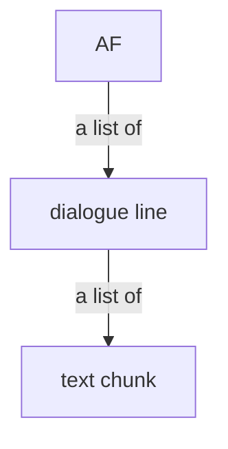

Annotation File is an intermediate representation used throughout ja_subify. In this documentation, "AF" is a short hand referring to it.

You can use the `import_srt` or `import_ass` program to create an Annotation File.

Annotation File can be edited by the `annotation_edit` program, or you can also edit it by hand or using scripts.

The purpose of AF is it can store furigana information (in this documentation, we will refer to "furigana" by the word "label" instead), and a few other metadatas useful for the editor program.

implemented in [annotation_file.py](../annotation_file.py).

## the format of AF

> [!NOTE]
>
> You can skip this section unless you're a developer or interested in working with the AF file contents yourself.

AF is an object tree structure, its demonstrated by this diagram below:



the raw representation of AF (when stored on disk or when loaded by ja_subify) is based on the [JSON](https://en.wikipedia.org/wiki/JSON), the current version has the following content:

```json
{
  "lines": [],
  "version": 0
}
```

this is the root node of AF.

this corresponds to the `AnnotationFile` class in Python.

where `lines` is a list of the following content:

```json
{
  "end_time": "00:01:23,456",
  "fragments": [],
  "lineno": 123,
  "orig_line": "お外がポカポカして気持ち良さそうです",
  "start_time": "00:01:23,456"
}
```

this is a dialogue line in the AF.

this corresponds to the `DialogueLine` class in Python.

`start_time` and `end_time` have same meaning just like timestamps in an SRT subtitle.

`lineno`, `orig_line` are ignored when AF get read by ja_subify (but updated, more specifically, overwritten when AF is saved by ja_subify). They are provided for convenience which might make it easier to deal with the file using external tools.

`fragments` is a list of the following content:

```json
{
  "checked": false,
  "ignore": false,
  "inner": {},
  "type": 0,
  "unfinished": false
}
```

this is a text chunk in the dialogue line.

this corresponds to the `Annotation` class in Python.

`ignore`, `unfinished` fields are used by the editor program. `checked` field is reserved.

`type` field decides how contents in `inner` is interpreted.

| `type` value | meaning |
| --- | --- |
| 0 | `inner` contains a "plain annotation" object |
| 1 | `inner` contains a "kanji annotation" object |
| 2 | `inner` contains a "loan word annotation" object |

these values corresponds to the `AnnotationType` enumeration in Python.

### "plain annotation" object

this object contains the following content:

```json
{
  "text": "ポカポカして"
}
```

this corresponds to the `PlainAnnotation` class in Python.

`text` field contains plain text that is part of the dialogue line, but has no labels.

### "kanji annotation" object

this object contains the following content:

```json
{
  "fragments": []
}
```

this object contains a list of adjacent kanji chunks from the same Japanese word but can be split into smaller part where each part can be pronounced separately.

this corresponds to the `KanjiAnnotation` class in Python.

`fragments` is a list of the following content:

```json
{
  "base": "外",
  "reading": "そと"
}
```

this corresponds to the `KanjiCharacters` class in Python.

the `base` field is the one or more continuous kanjis from the original japanese dialgoue line, that has inseparatable pronunciation (for example "海苔" reads "のり" but they read together and each kanji doesnt have its own pronunciation and it's impossible to read separately. this is made specifically to support ["Jukujikun"](https://ja.wikipedia.org/wiki/%E7%86%9F%E5%AD%97%E8%A8%93)), `reading` is its pronunciation in its context.

### "loan word annotation" object

this object contains the following content:

```json
{
  "base": "ミラクル",
  "romanized": "miracle"
}
```

this corresponds to the `LoanAnnotation` class in Python.

`base` field is the original japanese text of this loan word, and `romanized` field is the english version which shall be displayed as a label on top when rendered by ja_subify.

## `import_srt`, `import_ass`

these program can read an existing subtitle file and convert it into an Annotation File.

it can also update timings in an existing Annotation File if the AF was created from the same subtitle file. The use case of this is you can retime the original subtitle using existing softwares, for example, in Aegisub, then you can use the `--retime` option to also update timings in the `.annotations` file that you have already imported previously, without losing your labels. The limitation is the program will check if your AF really appear to come from the same subtitle file. (i.e. If you have inserted, deleted, added or modified contents of dialogues in the original subtitle file, retiming will currently fail.)
