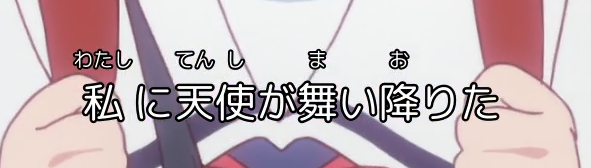
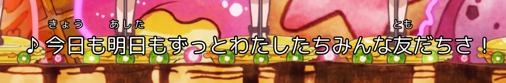
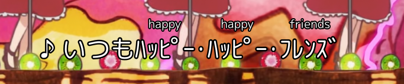
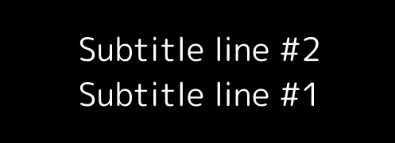
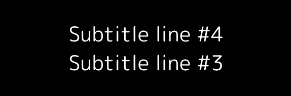
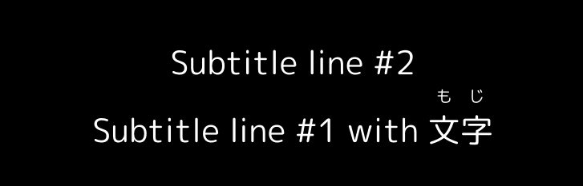
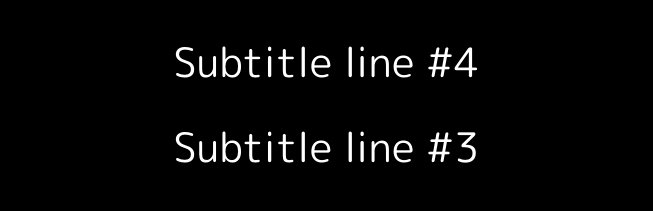

ja_subify currently provide two rendering options

HTML and ASS (Advanced SubStation Alpha)

use the HTML exporter (`render_html`) if you wish to have the annotated transcript with you in text document form. or maybe if you want to print it. the use case is you can easily share the dialogue text with others or read it on a mobile device.

use the ASS exporter (`export_ass`) so it can be loaded by a video player on your PC or be fed into encoding programs like FFmpeg to generate video files with subtitles burnt in.

the HTML renderer program is actually pretty simple to use so we will omit talking about it in this documentation.

```shell
$ ./export_ass --help
usage: export_ass [-h] --ass-file ASS_FILE [--font-name FONT_NAME]
                  [--video-x VIDEO_X] [--video-y VIDEO_Y] [--font-size FONT_SIZE]
                  [--margin-y MARGIN_Y] [--outline-size OUTLINE_SIZE]
                  [--shadow-size SHADOW_SIZE] [--rubi-shadow-size RUBI_SHADOW_SIZE]
                  [--rubi-outline-size RUBI_OUTLINE_SIZE]
                  [--loans-blacklist LOANS_BLACKLIST]
                  [--word-blacklist WORD_BLACKLIST] [--no-rubi] [--no-loans]
                  input_file
```

don't be scared by these options, most of these contain a default value that should work in most cases.

a simplest call (yet works) is just: `./export_ass my_af.annotations -o out.ass`

subtitles generated by `export_ass` might display incorrectly on other machines except where it was created, unless you have the same font installed.

Furthermore, the ASS exporter currently doesn't implement a correct font fallbacking logic. If your input Annotation File contains character not in the font you specified (most of the case, certain emojis), things might not display correctly.

another limitation is `export_ass` doesn't currently have much ability to change placements of rendered subtitle lines.

### Windows behavior

`export_ass` needs a few DLLs files to work on Windows (equivalents is also needed on other platforms but it's harder to get them on Windows)

ja_subify shipped a folder named `msvc_sup` which contains these files, see more details in [here](../msvc_sup/readme.TXT).

if you package ja_subify yourself, be sure to take this into accounts otherwise you will see erorrs complaining the DLLs are not found.

### ASS rendering behavior

this section mentions behavior facts of the `export_ass` program, but the behaviors is not currently tweakable.

* Font size of Furigana is always half of the font size configured using the `--font-size` option. this value has the same meaning as font size values in Aegisub and ASS styles. It must be an integer.

* there is two different handling mode for Furigana display as demonstrated in the pictures below





the first picture demonstrates the first mode, when Furigana is simply centered over the text it belongs to.

note Furigana characters on the word "私" is longer than the word under it, so it extends and leaves gaps before and after.

This mode is used when the word itself is only one Kanji character or if the label is longer than the word under it.

in the second picture, Furiganas on top of words "今日" and "明日" are spread evenly over the text under it, even though "きょう" and "あした" is shorter than the text under it.

This mode is used if the label treats the word under it as a whole (more information about it [here](worddb.MD#adding-word-into-dictionary)) and the word is more than one Kanji character, and the text above it (the label) is shorter than the word itself.

* For loan words, english is displayed on top of those words just like Furigana on top of kanjis. And Katakana and middle dots are converted into half-width characters, as demonstrated by the picture below:



* If two subtitle lines are displayed at same time (because their timing collide), ja_subify pre-calculates and stack the subtitles just like normal video players. ja_subify may leave extra spacing between two stacked subtitles lines, to ensure stacked subtitles always appear at same Y coordinate when the stacking level is same. This is relevant when subtitles contains lines with no labels, which has smaller height, and on the same stacking level a different subtitle line with labels would show somewhere in the time line (which is taller). then for all subtitles that should be placed above this stacking level, ja_subify always position the subtitle lines above using the maximum subtitle height ever appeared under the line. This is to prevent subtitles from shifting veritically as playback progresses.

for example if you have 4 subtitles where #1 and #2 is showed together first in the video and #3, #4 are showed together later in the video

#2 will be stacked over #1. so as #3 should be stack on top of #4.

if #1 doesn't have labels, it looks like this:

 

however if #1 has labels, #4 will apply some extra spacing over #3:

 
