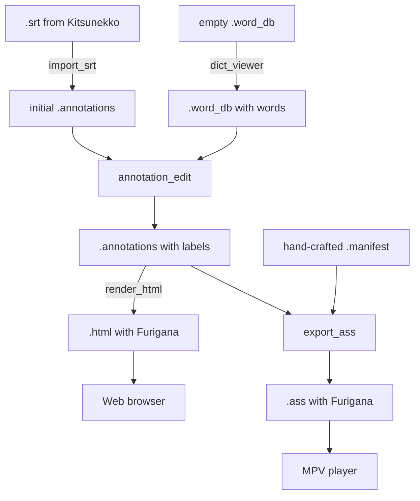

this directory contains user how-to guide in text and this is the index page.

## Introduction

ja_subify is a monorepo collection of command-line and graphical programs.

In ja_subify, anime subtitles are not created from scratch. Ultimately, they all come from official releases by Japanese anime streaming services. Using unofficial subtitles or subtitles created by yourself may or may not work well.

External runtime dependencies of ja_subify is kept at minimum, currently they're: [FreeType library](https://freetype.org/), [Fontconfig library](https://www.freedesktop.org/wiki/Software/fontconfig/), [PySide6 package](https://pypi.org/project/PySide6/).

## work-flow outlines

## Table of contents

* [Annotation File (and related utilities)](af.MD)
* [Manifest File](mf.MD)

## General tips

- read `--help` outputs of ja_subify programs.

- sometimes in the beginning of source code files there is a short explanation of that topic. if you're a developer, public methods and classes have comments before its body, which contains some information potentially useful.

- ja_subify uses UTF-8 encoding with UNIX LF newline breaks (`\n`), not UTF-16 with Windows CRLF style (`\r\n`). Note on this especially if you're on Windows and modifying files created by ja_subify using other programs, messing up these assumptions might confuse ja_subify. (This includes the input files you feed into ja_subify, for example, `.srt` files you feed into `import_srt`. You need to convert any input files into the right encoding and line-break style using other tools (for example, `iconv` and `dos2unix` commands from Msys2) before trying to feed them into ja_subify.)
