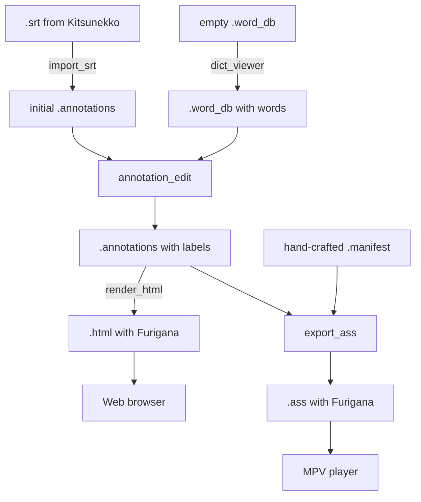

this directory contains user how-to guide in text and this is the index page.

## work-flow outlines

## General tips

- ja_subify uses UTF-8 encoding with UNIX LF newline breaks (`\n`), not UTF-16 with Windows CRLF style (`\r\n`). Note on this especially if you're on Windows and modifying files created by ja_subify using other programs, messing up these assumptions might confuse ja_subify. (This includes the input files you feed into ja_subify, for example, `.srt` files you feed into `import_srt`. You need to convert any input files into the right encoding and line-break style using other tools (for example, `iconv` and `dos2unix` commands from Msys2) before trying to feed them into ja_subify.)
