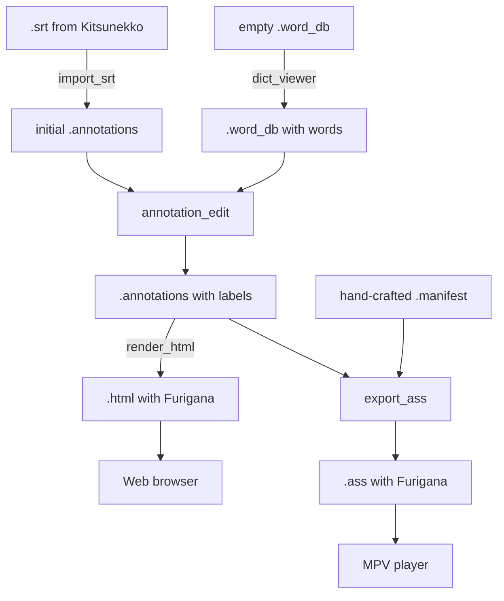

this directory contains user how-to guide in text and this is the index page.

## work-flow outlines

```mermaid
flowchart TD
  A[.srt from Kitsunekko]
  B[initial .annotations]
  A -->|import_srt| B

  C[empty .word_db]
  D[.word_db with words]
  C -->|dict_viewer| D

  E[annotation_edit]
  F[.annotations with labels]
  B & D --> E --> F

  G[.html with Furigana]
  H[Web browser]
  F -->|render_html| G --> H

  I[hand-crafted .manifest]
  J[export_ass]
  K[.ass with Furigana]
  L[MPV player]
  I & F --> J --> K --> L
```
