WordDB dictionary files is used by the Annotation File editor to add labels to dialogue texts. it stores information about labels, so you don't have to create the label from scratch every time.

the actual possibility with these files are probably more, for example: the `annotation_edit` program has ability to load multiple dictionary files. so you can have for example, say, two dictionaries, one contains generic japanese word and one contains special terms used only by a single anime series / work; the `render_html` and `export_ass` programs support specifying user dictionary files as a blacklist to hide labels (Furiganas) for certain words in the rendering results.

be careful when dealing with the file using external programs, do not leave blank lines in the file and the file should always end with exactly one line break at the end (unless when the dictionary is empty), otherwise ja_subify will be confused. Comments in the file are not currently supported.

implemented as [normal_word_db.py](../normal_word_db.py) and [loan_word_db.py](../loan_word_db.py).

## creating a new dictionary

just create an empty text file without any content. (absoletely no characters, not even spaces or line breaks. the file size should be zero.)

## adding word into dictionary

ja_subify includes a program called `dict_viewer`, despite the name it currently only support adding new words into dictionary files. in this section we will demonstrate how to do this.

launch the dictionary viewer with `-f` option followed by location of your dictionary file (use the `-l` to pass a "loan word db"), it should show a screen like this:

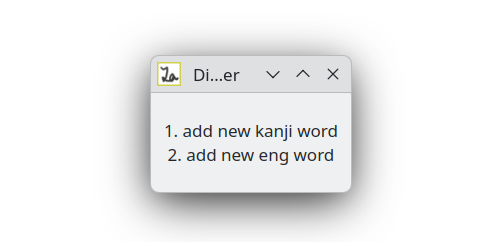

press "1" on your keyboard will open a dialog with a input box like this image:

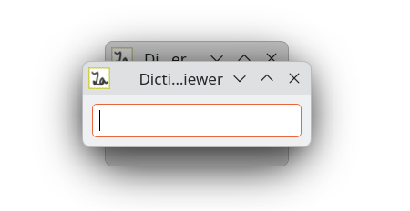

type the japanese word, for example, "最高" and hit ENTER key. it should bring up yet another dialog with a new empty text box:

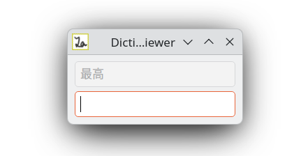

in the new text box, type the pronunciation of the japanese word, in this case, "さいこう" and hit ENTER. it would show a window like this:

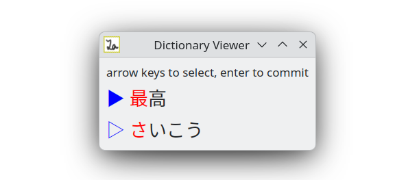

tweak the selection until it highlights the first one or more kanji characters that has inseparatable pronunciation (more on this [later](#kanji-characters-fragment-object) in this documentation.) then hit ENTER key once.

in this case, we want to ensure that we have selected "最".

the program ensures that you will always select at least one character.

the filled blue triangle indicates which row your selection cursor is currently at.

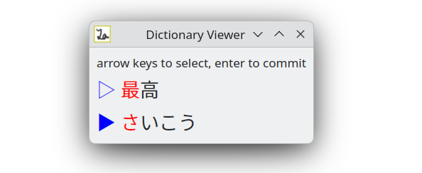

after you hit ENTER, the filled blue triangle moves to the 2nd row, which allows you to select the pronunciation for the range you just have selected in the first row.

we want to select "さい" and hit ENTER once.

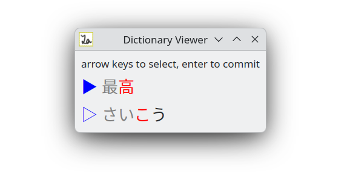

once you did that and hit ENTER, the process restart and you can repeat the same step until you have assigned pronunciation for everything in the word you wanted to add.

the window will close after you have finished the process, and you should see a success message in your terminal output:

```
$ ./dict_viewer -f my_dict.word_db
new word
base: '最高'
flat: 'さいこう'
commit kanji_chars: 最(さい)
commit kanji_chars: 高(こう)
word added successfully
```

if anything goes wrong, for example if you ran out of character on a row but not on the other row the program will close the window and print an error in the terminal:

```
ran out of chars
user canceled or error occurred
```

let's see another example, say you want to add word "優しい" into your dictionary

when you have non kanji characters on both row, just select them on both rows, just like in the images below.

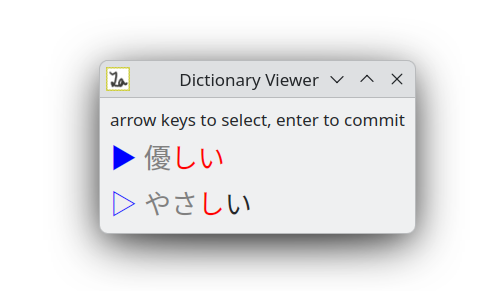

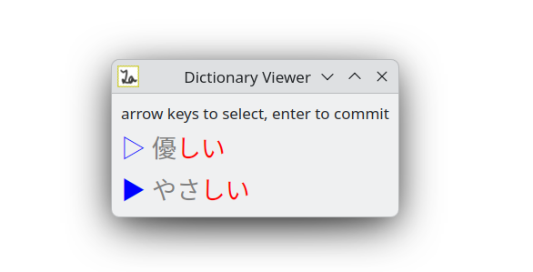

then ENTER.

now let's see a different case, assume you have a word consist of both kanji and english, an example, "決めポーズ", input them like this:

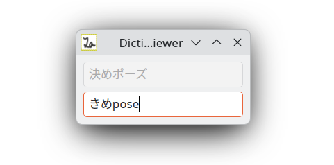

note that if your word contains two adjacent english words, dont add spaces between them here.

then just line up the selections on both row using the old theory.

Okay, now, I guess you have already guessed how to add loan (English) words, but here is an example:

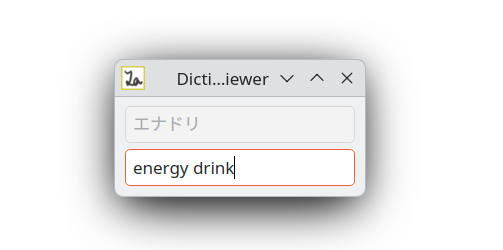

when adding loan words, you can only move selection on the first row. the second row is determined automatically by spaces that you inputted in the last dialog with input boxes.

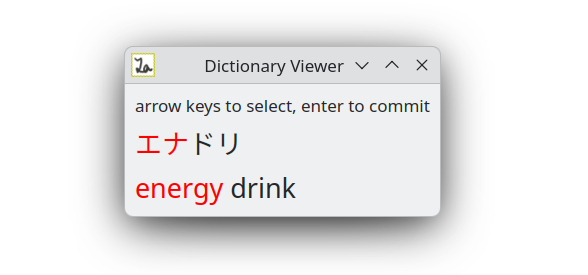

everything else should work very similarly.

some other information: pressing ESC key would close any window or dialog and cancel the action you're doing, or even quit `dict_viewer`.

## removing words from a dictionary

first, ensure you have closed all programs that have loaded the dictionary. this is because it messes up ja_subify's partial reloading of dictionary files.

then, open the dictionary file in a text editor, delete the line containing the word that you want to remove.

## technical information

there is two kind of dictionary files in ja_subify, "loan word db" and "normal word db", they both use the same extension `.word_db`.

> [!NOTE]
>
> You can skip the contents below in this section if you're not a developer or attempting to modify the contents manually.

when loaded in Python, they're a `LoanWordList` or `NormalWordList` object.

to detect type of a `.word_db` programmatically, peek at the first character in its contents. if it's a "{" then it's a "normal word db", otherwise it's a "loan word db". (doesn't work if when the dictionary is empty.)

each line in a "normal word db" file contains a JSON object. "loan word db" uses a simpler format, based on [TSV](https://en.wikipedia.org/wiki/Tab-separated_values).

the reason to have two kind of dictionary files is that most words with loan words are simple enough so its more elegant to just use TSV instead of JSON.

there is trivial checks on duplicate word entries. the `dict_viewer` program also rejects adding duplicating word entries.

### format of "loan word db"

each line in the file is split into two parts by a TAB character, the first part contains the original japanese text for the loan word, second part contains the english version of that word.

when loaded in Python, a word entry is a `LoanWord` object.

first part is then split into fragments if it contains NUL characters (`\x00` in Python), and the second part is split by spaces. the number of fragments in first part always matches the number of fragments in second part. This is used to support words that is made of multiple english words.

when loaded in Python, each pair of fragments is a `LoanFragment` object.

### format of "normal word db"

each line in a normal word db is a word represented using a JSON object in this format:

```json
{"base": "お日様", "fragments": []}
```

this correspond to the `NormalTemplate` class in Python.

this means a word entry in the dictionary

where `base` field is the japanese word, `fragments` is a list of the following object:

```json
{"inner": {}, "type": 0}
```

this is a chunk inside the word

the content in `inner` is determined by the value of `type` field

| `type` value | meaning |
| --- | --- |
| 0 | `inner` contains an "ignore" fragment object |
| 1 | `inner` contains a "kanji characters" fragment object |
| 2 | `inner` contains a "loan word" fragment object |

values correspond to the enumeration `FragmentType` in Python.

#### "ignore" fragment object

this object contains:

```json
{"text": "お"}
```

this correspond to the `FragmentIgnore` class in Python.

`text` is part of the word that has no label, for example it's written as Hiragana/Katakana in the original word or is an [Okurigana](https://ja.wikipedia.org/wiki/%E9%80%81%E3%82%8A%E3%81%8C%E3%81%AA).

#### "kanji characters" fragment object

this object contains:

```json
{"base": "日", "reading": "ひ"}
```

this correspond to the `FragmentKanjiCharacters` class in Python.

`base` is one or more kanji characters that has inseparatable pronunciation (more on this in the [Annotation File](af.MD#kanji-annotation-object) documentation.) and `reading` is its pronunciation in its context.

#### "loan word" fragment object

this object contains:

```json
{"base": "ポーズ", "romanized": "pose"}
```

this correspond to the `FragmentLoanword` class in Python.

`base` is the original japanese text of this loan word, `romanized` is the english version of it.

the reason this exists while we already have "loan word db" is: some word use a mixture of both kanji and english words, so an entry in a "loan word db" isn't enough.
